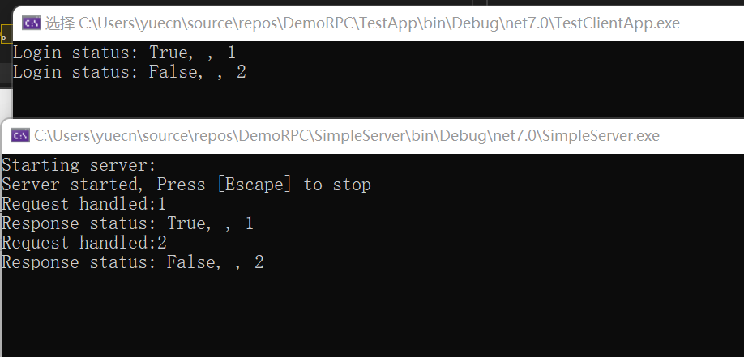

# DemoRPC

## Start

同时启动： SimpleServer  和 TestClientApp。

## SimpleServer

基于Socket 实现的TCP server, 可以单独启动，并监听配置的端口，处理指定类型的（目前只有Login，可扩展）客户端的信息。

说明：

1. 从配置读取服务器和监听信息，可以很容易扩展支持更多的配置，也方便后面切换到配置中心，以支持管理，授权和热加载功能；
2. 基于扩展方法的依赖注入配置，可以方便的注册更多的服务，和管理不同的生命周期，避免手动创建实例，实现服务之间依赖关系的松耦合；
3. 采用单例来注册服务器实例，以确保只有一个服务器实例运行(一个instance 上)，和避免端口冲突；
4. 使用委托来实现日志功能，可以用方便的切换到不同的日志目标，或者支持同时写多种目标日志；
5. 用扩展方法实现了Socket 的 Receive 和 Send 方法，以重用逻辑（在Client 和 Server 间);
（时间关系，未能实现的部分）
6. 如果Authorization 基于数据库实现（本项基于内存）， 可以引入Second level cache 以提高性能；
7. 如果用ORM， 可以选用轻量级ORM，如Dapper， 或者也可以用EF core, 使用缓存预热，预先加载，延迟加载，first level cachae 等功能；
8. 定时清理长时间没有数据收发的socket；
9. 集群部署，扩展服务能力，客户端连接时选择固定的主机进行服务（类似于cookie affinity： 客户端记住主机的key, 每次连接传，服务端根据此信息每次都foward 到指定主机即可）；
10. socket 重用实现，类似于池的概念（我目前不太清楚，但是看到它支持这个功能）。

## SimpleClient

基于Socket 实现的TCP client， 需要其他应用调用（如： TestClientApp）， 可以发送指定类型的信息（目前只有Login，可扩展）到TCP Server， 并处理TCP server 发送回来的信息.

说明：

1. 同SimpleServer #1；

2. 同SimpleServer #2；

3. Socket Service 是单例，而且收发是用自旋的信号量上锁，限定同一时间只有一个Socket 用来收发信息， 避免冲突；
4. 同SimpleServer #5
5. 遵守SOLID设计原则，项目易扩展，易读易维护，低耦合；
6. 参考Clean Design (没有完全符合，还有不少优化空间)，尽量减少高层模块和低层模块之间的依赖，只依赖于抽象；
7. 注重clean design，设计基本符合：DRY, YAGNI， KISS 原则；
